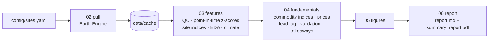

# Metals & Minerals Satellite Monitor

[](https://github.com/n9omi/metals-satellite-monitor/actions/workflows/ci.yml)

Monthly satellite monitoring of metals and minerals supply, built on Google Earth Engine.
The pipeline pulls activity signals over 15 mines, smelters, industrial parks, ports and brine
fields (copper, nickel/PGMs, lithium, iron ore, bauxite) plus climate over five hydro- and
weather-exposed supply regions. It then runs exploratory and fundamental analysis and writes a
**summary analysis PDF** every run.

**Latest report:** [`reports/summary_report.pdf`](reports/summary_report.pdf) · [`reports/report.md`](reports/report.md) (written by the first live run; `bash run.sh --demo` shows the layout with synthetic data)

---

## Questions it answers

- Is activity at a key site above or below its own seasonal norm this month? Which signal is driving that?
- Is a site's footprint (pit, dumps, ponds, plant) growing faster than its history? That is a capacity signal.
- Taken across all monitored sites, is copper, nickel or lithium supply activity rising or falling?
- Are hydro-dependent smelting regions (Yunnan, Sichuan, the Kariba catchment) heading into drought? Are haulage regions (Boké, the Pilbara) in an extreme wet season?
- Do any of these signals lead prices or reported production, once autocorrelation is accounted for?

## How it works



| Signal | Earth Engine dataset | What it proxies | Main caveat |
|---|---|---|---|
| Surface change, bare ground, pond area | Sentinel-2 SR + Cloud Score+ | Mining activity, footprint growth, brine in evaporation | Cloud (tropics), snow |
| SAR backscatter, SAR change, SAR water | Sentinel-1 GRD (one orbit direction) | Activity through cloud, stockpiles, flooding | Speckle; S1B loss 2022-24 thins revisits |
| NO<sub>2</sub> / SO<sub>2</sub> enhancement | Sentinel-5P TROPOMI OFFL L3 | Smelter and captive coal-plant throughput | Wind, nearby towns; no data in polar night |
| Night lights | VIIRS DNB monthly (stray-light corrected) | Operating intensity, ports and plants | Cloud; polar summer gaps |
| Thermal-anomaly pixel-days | MODIS FIRMS | Furnaces, flares (and wildfires) | Land-clearing fires near sites |
| Bare + built footprint | Dynamic World V1 | Capacity expansion, forest clearance | Class confusion in arid terrain |
| Rainfall, temperature | CHIRPS pentad, ERA5-Land monthly | Hydro-power and water risk; haulage disruption | Region-scale only |

## Quick start

### 1. Demo (no Earth Engine account needed)

```bash
pip install -e ".[dev]"
bash run.sh --demo          # synthetic data -> demo_out/reports/summary_report.pdf
```

The demo uses random series with three built-in stories: a mine shutdown, an industrial-park
ramp-up and a hydro-region drought. Every demo page is watermarked **SYNTHETIC DEMO DATA**.

### 2. Live run

1. Register a Google Cloud project for Earth Engine. Earth Engine is free for research, education
   and nonprofit use.
2. `cp .env.example .env` and set `EE_PROJECT=<your-project-id>`.
3. `earthengine authenticate` (once per machine).
4. Verify every site outline (do this first, and again whenever you edit coordinates):
   ```bash
   bash run.sh --check-sites   # figures/site_checks/<site>.png + rois.geojson (opens in QGIS)
   ```
5. Run the pipeline:
   ```bash
   bash run.sh                 # first run pulls 2019 to now; later runs only fetch new months
   ```

Useful flags (passed to every step): `--commodities copper,nickel`, `--sites escondida,norilsk`,
`--start 2020-01-01`, `--prices-csv my_prices.csv`, `--production-csv my_production.csv`,
`--workers 4`, `--chunk-months 6` (use this if Earth Engine times out), `--refresh`, and
`--from 03` (re-run analysis from the cache, no Earth Engine calls).

## Pipeline

| Step | Script | Reads | Writes |
|---|---|---|---|
| 01 | `pipeline/01_check_sites.py` | config | `figures/site_checks/*.png`, `rois.geojson` |
| 02 | `pipeline/02_pull.py` | config, Earth Engine | `data/cache/<site>__<signal>.csv` (incremental) |
| 03 | `pipeline/03_features.py` | cache | `outputs/site_panel.csv`, `site_zscores.csv`, `site_indices.csv`, `eda_summary.csv`, `eda_corr/`, `coverage.csv`, `climate_metrics.csv` |
| 04 | `pipeline/04_fundamentals.py` | step 03 outputs, prices | `outputs/commodity_indices.csv`, `prices_monthly.csv`, `lead_lag*.csv`, `production_validation.csv`, `anomalies_recent.csv`, `*_snapshot.csv`, `run_meta.json` |
| 05 | `pipeline/05_figures.py` | outputs | `figures/*.png` |
| 06 | `pipeline/06_report.py` | outputs, figures | `reports/report.md`, `reports/summary_report.pdf`, `reports/archive/summary_report_<YYYY-MM>.pdf` |

`bash run.sh` runs steps 02 to 06. Each step can also run on its own (`python pipeline/04_fundamentals.py`)
or through the console script (`metals-monitor fundamentals`). `outputs/`, `figures/`, `reports/`
and the CSV cache are committed, so results stay visible on GitHub. `.env`, keys and `*.parquet`
are never committed.

## The summary PDF

1. **Summary page:** headline tiles, auto-generated key takeaways, and a commodity table (3-month
   utilization z, change, capacity z, largest site moves).
2. **Commodity and site activity:** commodity index small multiples, plus a site × month heatmap.
3. **Climate and power-supply risk:** SPI-3-like rainfall anomaly, temperature anomaly and flags for each region.
4. **Site snapshot and recent anomalies:** every signal move of 2 or more standard deviations in the last six months.
5. **Price linkage and validation:** best-lag correlations with an autocorrelation-adjusted sample
   size, correlation against reported production, and a data-coverage table.
6. **Site appendix:** one page per site, with every signal and both indices.
7. **Methodology, caveats and data attribution.**

## Method in one paragraph

Each signal becomes a **point-in-time seasonal z-score**: the value minus the mean of the same
calendar month in prior years, divided by the standard deviation of past anomalies. Only data
available at that month is used, so the indices can be backtested without look-ahead. The
**utilization index** averages signed z-scores of throughput proxies (SO<sub>2</sub>/NO<sub>2</sub> enhancement,
night lights, hotspots, surface and SAR change). The **capacity index** averages z-scores of
smoothed footprint proxies (bare/built area, plus pond area at brine sites). Commodity indices
are weighted site averages; weights live in `config/sites.yaml`. Full detail, thresholds and
formulas: [docs/methodology.md](docs/methodology.md).

## Limitations (read before using a number)

- These are **activity proxies, not production measurements**. A ±2 z-score says a signal is unusual, not why.
- Underground mines (Kamoa-Kakula, Grasberg block cave) only expose surface infrastructure.
- Coordinates are approximate. Always run `--check-sites` after editing them.
- Price lead-lag tests 13 lags per pair on roughly 90 monthly points, so treat any "hit" as a
  hypothesis. Validation against reported output (`--production-csv`) is the stronger test.
- Earth Engine datasets have publication lags (VIIRS monthly about 1-2 months, CHIRPS about 1 month).
  The latest month may be partial; the coverage table shows the gaps.

## Automating

`.github/workflows/monthly-report.yml` runs the live pipeline on the 8th of each month and
commits the refreshed cache, outputs, figures and PDF. It needs an Earth Engine service account.
Setup steps are in the workflow file header; the secrets are `EE_PROJECT` and
`GEE_SERVICE_ACCOUNT_KEY`. `ci.yml` lints, tests, and builds the demo PDF as an artifact on every push.

## Extending

- **Add a site:** add an entry under `sites:` in `config/sites.yaml` (lat, lon, buffer_km, role,
  commodities, indicators, optional weight), run `--check-sites`, then `bash run.sh`. Only the new
  series is pulled.
- **Add prices for commodities without a free futures feed** (nickel, lithium, iron ore):
  `--prices-csv` with columns `date,commodity,price`.
- **Explore interactively:** `marimo edit notebooks/explore.py`.

## Repository layout

```
config/sites.yaml            sites, regions, price tickers
src/metals_monitor/          package: ee_signals, pull, analytics, charts, report_pdf, ...
pipeline/01..06_*.py         numbered pipeline steps (run.sh runs 02-06)
data/cache/                  Earth Engine pull cache (CSV, incremental)
outputs/  figures/  reports/ committed results
notebooks/explore.py         marimo explorer
tests/                       pytest suite (runs the demo pipeline end to end)
docs/methodology.md          formulas, thresholds, QC rules
```

## Data and attribution

Contains modified Copernicus Sentinel data (Sentinel-1, -2, -5P) processed in Google Earth Engine;
Cloud Score+ and Dynamic World (Google, CC-BY-4.0); VIIRS DNB monthly composites (Earth
Observation Group, Colorado School of Mines); FIRMS (NASA LANCE/EOSDIS, near-real-time, not
science quality); CHIRPS (UCSB Climate Hazards Center); ERA5-Land (ECMWF / Copernicus Climate
Change Service). Prices via yfinance for research use.

Code: MIT License.
